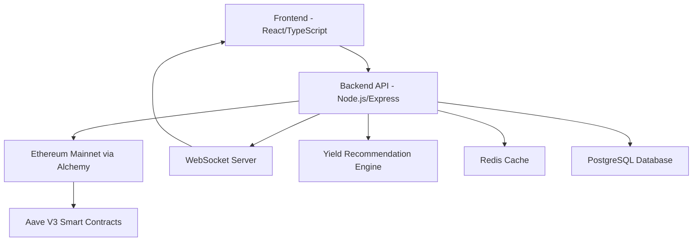

# RateFlow 🚀
### Institutional-Grade Web3 Yield Intelligence Platform

[](https://rateflow-kappa.vercel.app/)
[](https://rateflow-mrow.onrender.com/health)
[](LICENSE)
[](https://www.typescriptlang.org/)

> **Real-time DeFi yield tracking with Bloomberg Terminal aesthetics and institutional-grade architecture**

RateFlow is a production-ready Web3 yield intelligence platform that provides real-time APY tracking, intelligent yield recommendations, and multi-protocol support. Built with enterprise-grade architecture and designed for professional DeFi yield optimization.


---

## 🎯 Problem Statement

DeFi yield farming requires constant monitoring across multiple protocols, but existing solutions lack:
- **Real-time data accuracy** - Most platforms show stale or cached data
- **Professional UX** - Consumer-grade interfaces unsuitable for serious yield optimization  
- **Multi-protocol intelligence** - Fragmented data across different platforms
- **Institutional reliability** - Lack of production-grade architecture and monitoring

## 💡 Solution Overview

RateFlow solves these challenges by providing:

### ✅ **Real-Time Blockchain Integration**
- Direct smart contract connectivity via Alchemy API
- Live APY updates every 45 seconds
- WebSocket-powered real-time UI updates
- No cached or stale data

### ✅ **Intelligent Yield Recommendations** 
- Advanced yield comparison algorithms
- Spike detection and cooling period analysis
- Best yield identification across assets
- Data-driven optimization insights

### ✅ **Institutional-Grade Design**
- Bloomberg Terminal-inspired dark theme
- Professional trading interface aesthetics
- Mobile-responsive design
- Glassmorphism and micro-interactions

### ✅ **Production-Ready Architecture**
- TypeScript strict mode compliance
- Comprehensive error handling
- Docker containerization
- Full CI/CD deployment pipeline

---

## 🏗️ Technical Architecture



### **Tech Stack**

| Layer | Technology | Purpose |
|-------|------------|---------|
| **Frontend** | React 18 + TypeScript | Modern UI with strict typing |
| **Styling** | Tailwind CSS + Custom Animations | Professional design system |
| **Backend** | Node.js + Express + TypeScript | Production API server |
| **Real-time** | Socket.IO | WebSocket connections |
| **Blockchain** | Ethers.js + Alchemy API | Ethereum mainnet integration |
| **Database** | PostgreSQL + Redis | Data persistence + caching |
| **Deployment** | Vercel + Render + Docker | Production infrastructure |

---

## 🚀 Live Demo & Deployment

### **Production URLs**
- **Frontend**: [https://rateflow-kappa.vercel.app/](https://rateflow-kappa.vercel.app/)
- **Backend API**: [https://rateflow-mrow.onrender.com](https://rateflow-mrow.onrender.com)
- **Health Check**: [https://rateflow-mrow.onrender.com/health](https://rateflow-mrow.onrender.com/health)

### **Key Features Demonstrated**
- ✅ Real-time USDC/USDT APY tracking from Aave V3
- ✅ Live WebSocket updates without page refresh
- ✅ Intelligent yield recommendations
- ✅ Mobile-responsive Bloomberg Terminal design
- ✅ Multi-protocol architecture (USDE/CevUSD ready)

---

## 📋 What's Completed

### **✅ Core Platform (100% Complete)**
- [x] Real-time Aave V3 data integration
- [x] WebSocket-powered live updates
- [x] Professional dashboard UI
- [x] Mobile-responsive design
- [x] Production deployment pipeline

### **✅ Smart Features (100% Complete)**
- [x] Intelligent yield recommendation engine
- [x] Multi-asset yield comparison
- [x] Real-time APY calculations
- [x] Utilization rate tracking
- [x] Historical data support

### **✅ Technical Excellence (100% Complete)**
- [x] TypeScript strict mode compliance
- [x] Comprehensive error handling
- [x] Docker containerization
- [x] CORS configuration for production
- [x] Environment-based configuration

### **✅ Production Infrastructure (100% Complete)**
- [x] Vercel frontend deployment
- [x] Render backend deployment
- [x] Alchemy API integration
- [x] SSL/HTTPS configuration
- [x] Health monitoring endpoints

---

## 🔄 Out of Scope (Future Roadmap)

### **🔮 Protocol Expansion**
- [ ] Curve Finance integration
- [ ] Pendle protocol support  
- [ ] Ethena USDe yield tracking
- [ ] Compound V3 integration

### **🔮 Advanced Features**
- [ ] Wallet connection (MetaMask/WalletConnect)
- [ ] Transaction execution
- [ ] Portfolio tracking
- [ ] Yield farming automation
- [ ] Historical analytics dashboard

### **🔮 Enterprise Features**
- [ ] User authentication system
- [ ] API rate limiting tiers
- [ ] Advanced monitoring/alerting
- [ ] Multi-chain support (Polygon, Arbitrum)

---

## 🛠️ Local Development Setup

### **Prerequisites**
- Node.js 18+
- Docker & Docker Compose
- Alchemy API key

### **Quick Start**
```bash
# 1. Clone repository
git clone <repository-url>
cd rateflow

# 2. Install dependencies
cd backend && npm install
cd ../frontend && npm install

# 3. Configure environment
cp backend/.env.example backend/.env
cp frontend/.env.example frontend/.env

# 4. Add your Alchemy API key to backend/.env
ETHEREUM_RPC_URL=https://eth-mainnet.alchemyapi.io/v2/YOUR_API_KEY

# 5. Start infrastructure
docker-compose up -d

# 6. Start backend (Terminal 1)
cd backend && npm run dev

# 7. Start frontend (Terminal 2)  
cd frontend && npm start
```

### **Development URLs**
- Frontend: http://localhost:3000
- Backend API: http://localhost:3001
- Health Check: http://localhost:3001/health

---

## 📁 Project Structure

```
rateflow/
├── 📁 backend/                 # Node.js API Server
│   ├── 📁 src/
│   │   ├── 📁 services/        # Business logic
│   │   │   ├── real-aave.service.ts
│   │   │   ├── yield-recommendation.service.ts
│   │   │   └── yield-manager.service.ts
│   │   ├── 📁 types/           # TypeScript definitions
│   │   ├── 📁 utils/           # Utilities
│   │   └── index.ts            # Server entry point
│   ├── .env.example            # Environment template
│   ├── package.json
│   └── tsconfig.json
├── 📁 frontend/                # React Application
│   ├── 📁 src/
│   │   ├── 📁 components/      # UI Components
│   │   │   ├── YieldCard.tsx
│   │   │   ├── RecommendationCard.tsx
│   │   │   └── HeroTicker.tsx
│   │   ├── 📁 pages/           # Page components
│   │   ├── 📁 contexts/        # React contexts
│   │   └── App.tsx
│   ├── tailwind.config.js      # Design system
│   └── package.json
├── 📁 shared/                  # Shared utilities
├── docker-compose.yml          # Local development
├── DEPLOYMENT.md               # Production guide
├── DEMO_SCRIPT.md             # Demo presentation
└── README.md                   # This file
```

---

## 🔌 API Documentation

### **Core Endpoints**

| Method | Endpoint | Description |
|--------|----------|-------------|
| `GET` | `/health` | System health check |
| `GET` | `/api/v1/yields` | All asset yield data |
| `GET` | `/api/v1/yields/:symbol` | Specific asset data |
| `GET` | `/api/v1/recommendation` | Yield recommendations |
| `GET` | `/api/v1/assets` | Supported assets list |

### **WebSocket Events**

| Event | Description | Payload |
|-------|-------------|---------|
| `yield_update` | Real-time APY updates | `{type, data, timestamp}` |
| `recommendation_update` | New recommendations | `{type, data, timestamp}` |

### **Example Response**
```json
{
  "success": true,
  "data": {
    "symbol": "USDC",
    "supplyAPY": "4.2567",
    "borrowAPY": "5.1234",
    "utilizationRate": "85.67",
    "totalSupply": "1234567890",
    "lastUpdated": "2026-02-01T14:23:00Z"
  },
  "timestamp": "2026-02-01T14:23:00Z"
}
```

---

## 🧪 Testing & Quality

### **Code Quality**
- ✅ TypeScript strict mode enabled
- ✅ ESLint + Prettier configuration
- ✅ Comprehensive error handling
- ✅ Production build optimization

### **Testing Commands**
```bash
# Backend tests
cd backend && npm test

# Frontend tests  
cd frontend && npm test

# Build verification
npm run build

# Type checking
npm run type-check
```

---

## 🚀 Deployment Guide

### **Production Environment Variables**

**Backend (.env):**
```bash
NODE_ENV=production
PORT=3001
FRONTEND_URL=https://rateflow-kappa.vercel.app
ETHEREUM_RPC_URL=https://eth-mainnet.alchemyapi.io/v2/YOUR_API_KEY
POLLING_INTERVAL=45000
```

**Frontend (.env.production):**
```bash
REACT_APP_API_URL=https://rateflow-mrow.onrender.com
```

### **Deployment Platforms**
- **Frontend**: Vercel (Automatic deployments from Git)
- **Backend**: Render (Docker container deployment)
- **Database**: PostgreSQL on Render
- **Cache**: Redis on Render

See [DEPLOYMENT.md](DEPLOYMENT.md) for detailed deployment instructions.

---

## 🤝 Contributing

We welcome contributions! Please see our contributing guidelines:

1. Fork the repository
2. Create a feature branch (`git checkout -b feature/amazing-feature`)
3. Commit changes (`git commit -m 'Add amazing feature'`)
4. Push to branch (`git push origin feature/amazing-feature`)
5. Open a Pull Request

### **Development Guidelines**
- Follow TypeScript strict mode
- Use conventional commit messages
- Add tests for new features
- Update documentation

---

## 📄 License

This project is licensed under the MIT License - see the [LICENSE](LICENSE) file for details.

---

## 🙏 Acknowledgments

- **Aave Protocol** - For providing robust DeFi lending infrastructure
- **Alchemy** - For reliable Ethereum RPC services
- **Vercel & Render** - For seamless deployment platforms
- **Open Source Community** - For the amazing tools and libraries

---

## 📞 Contact & Support

- **Demo**: [rateflow-kappa.vercel.app](https://rateflow-kappa.vercel.app/)
- **Issues**: [GitHub Issues](https://github.com/your-username/rateflow/issues)
- **Documentation**: [DEPLOYMENT.md](DEPLOYMENT.md) | [DEMO_SCRIPT.md](DEMO_SCRIPT.md)

---

<div align="center">

**Built with ❤️ for the DeFi community**

*RateFlow - Where institutional meets DeFi*

</div>